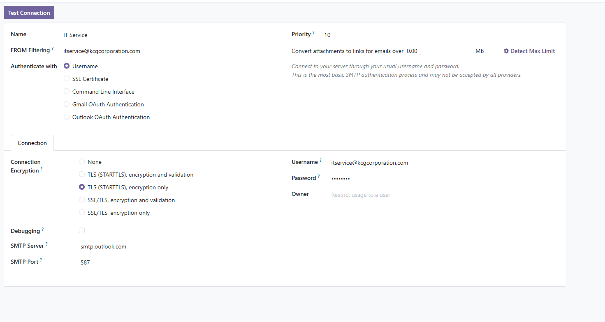

# Odoo

Odoo with docker

บน server รัน:
cd ~/Odoo
git pull
docker compose build --no-cache --progress=plain odoo
docker compose up -d

ถ้าผ่านแล้วดูสถานะ:
docker compose ps
docker compose logs -f odoo

##เข้าเว็บได้ที่:
http://10.110.23.90:8069

##หรือถ้าเปิดจากเครื่อง server เอง:
http://localhost:8069

##ถ้าเข้าเว็บจากข้างนอกไม่ได้ ให้เปิด firewall:
sudo ufw allow 8069/tcp
sudo ufw status

##ดู container:
docker compose ps

##ดู log ต่อ:
docker compose logs -f odoo

##แก้ email จาก notification@kcgcorporation.com > itservice@kcgcorporation.com
##ตรวจสอบ
docker compose exec -T db psql -U odoo -d KCG_ODOO -c "SELECT id, name, default_from, bounce_alias, catchall_alias FROM mail_alias_domain;"

docker compose exec -T db psql -U odoo -d KCG_ODOO -c "UPDATE mail_alias_domain SET name='kcgcorporation.com', default_from='itservice';"

##เพิ่ม role ใน database
docker compose stop odoo
docker compose run --rm odoo -d KCG_ODOO -i hr_admin_role --stop-after-init
docker compose up -d

docker compose stop odoo
docker compose run --rm odoo -d KCG_ODOO -u hr_admin_role --stop-after-init
docker compose up -d

##คำสั่งดูชื่อ database
docker compose exec db psql -U odoo -d postgres -c "\l"

##แก้ไข menu
เปิด develop mode
Settings → Technical → User Interface → Menu Items
ค้นหา menu ที่ต้องการปิด
เลือก dropdown ของ visibility เลือก administration
