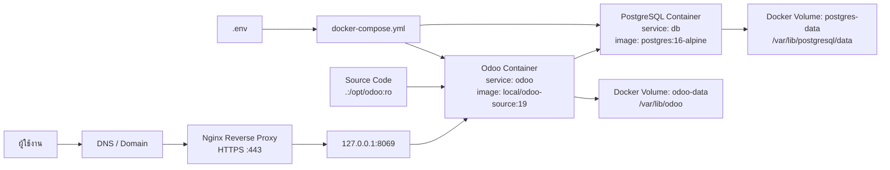

# คู่มือ Backup, Restore และ Migration สำหรับ Odoo Docker

เอกสารนี้อธิบายโครงสร้างระบบ Odoo Docker ปัจจุบัน วิธีใช้งาน `backup.sh` และ `restore.sh` รวมถึงแนวทางย้ายระบบไปยัง Azure Ubuntu VM อย่างปลอดภัย

## Architecture Diagram



## โครงสร้าง Docker Compose ปัจจุบัน

ระบบนี้ใช้ `docker-compose.yml` ที่ root ของโปรเจกต์ โดยมี service หลัก 2 ตัว

### Odoo Container

- Service name: `odoo`
- Build จาก `Dockerfile`
- Image: `local/odoo-source:19`
- Port mapping: `${ODOO_HTTP_PORT:-8069}:8069`
- Mount source code:
  - `.:/opt/odoo:ro`
- Mount data volume:
  - `odoo-data:/var/lib/odoo`
- Odoo filestore อยู่ที่:
  - `/var/lib/odoo/filestore`
- Config runtime ถูกสร้างจาก:
  - `docker/odoo.conf.template`

### PostgreSQL Container

- Service name: `db`
- Image: `postgres:16-alpine`
- Database volume:
  - `postgres-data:/var/lib/postgresql/data`
- Environment variables:
  - `POSTGRES_DB`
  - `POSTGRES_USER`
  - `POSTGRES_PASSWORD`
  - `PGDATA`

### Docker Volumes

- `postgres-data`
  - เก็บข้อมูล PostgreSQL ทั้งหมด
- `odoo-data`
  - เก็บ Odoo data directory รวมถึง filestore

### Docker Network

ไม่ได้กำหนด network เองใน `docker-compose.yml` ดังนั้น Docker Compose จะสร้าง default network ให้อัตโนมัติ และ container `odoo` จะเชื่อมต่อ database ผ่าน hostname `db`

## ไฟล์สำคัญที่ต้อง Backup

สคริปต์ `backup.sh` จะ backup รายการต่อไปนี้

- Source code ทั้งโปรเจกต์
- Custom addons ใน `addons/`
- Odoo core source ใน `odoo/`
- `docker-compose.yml`
- `.env` ถ้ามีอยู่จริง
- `env.example`
- `odoo.conf`
- `Dockerfile`
- โฟลเดอร์ `docker/`
- โฟลเดอร์ `deploy/`
- PostgreSQL globals
- PostgreSQL database dump ทุก database ที่ไม่ใช่ template และไม่ใช่ `postgres`
- Odoo filestore จาก `/var/lib/odoo/filestore`
- Metadata ของ container และ volume
- Cold archive ของ Docker volumes:
  - `postgres-data`
  - `odoo-data`

## ข้อกำหนดก่อนใช้งาน

ให้รันสคริปต์บน Linux server ที่มี Docker และ Docker Compose plugin พร้อมใช้งาน

```bash
docker --version
docker compose version
```

ตรวจสอบว่า stack สามารถเริ่มทำงานได้

```bash
docker compose up -d
docker compose ps
```

ตรวจสอบว่า Odoo และ PostgreSQL ทำงานปกติ

```bash
docker compose logs --tail=100 odoo
docker compose logs --tail=100 db
```

## Environment Variables

ระบบนี้ควรใช้ `.env` สำหรับค่าที่เป็น secret หรือค่าที่เปลี่ยนตาม environment

ตัวอย่างตัวแปรที่เกี่ยวข้อง

```bash
POSTGRES_USER=odoo
POSTGRES_PASSWORD=$(openssl rand -base64 32 | tr -d '\n')
ODOO_ADMIN_PASSWORD=$(openssl rand -base64 32 | tr -d '\n')
ODOO_HTTP_PORT=8069
ODOO_PROXY_MODE=True
ODOO_WORKERS=2
ODOO_MAX_CRON_THREADS=1
```

สร้างไฟล์ `.env` บน production server ด้วยคำสั่งนี้

```bash
POSTGRES_PASSWORD="$(openssl rand -base64 32 | tr -d '\n')"
ODOO_ADMIN_PASSWORD="$(openssl rand -base64 32 | tr -d '\n')"
cat > .env <<EOF
POSTGRES_USER=odoo
POSTGRES_PASSWORD=$POSTGRES_PASSWORD
ODOO_ADMIN_PASSWORD=$ODOO_ADMIN_PASSWORD
ODOO_HTTP_PORT=8069
ODOO_PROXY_MODE=True
ODOO_WORKERS=2
ODOO_MAX_CRON_THREADS=1
EOF
chmod 600 .env
```

ห้าม commit `.env` ที่มีรหัสผ่านจริงเข้า Git repository

## วิธีใช้งาน Backup

กำหนดสิทธิ์ execute ให้สคริปต์

```bash
chmod +x backup.sh
```

รัน backup

```bash
./backup.sh
```

เมื่อสำเร็จจะได้ไฟล์ในโฟลเดอร์ `backups/`

ชื่อไฟล์ archive จะอยู่ในรูปแบบ `backups/odoo-backup-<timestamp-utc>.tar.gz` และมี checksum คู่กันเป็น `backups/odoo-backup-<timestamp-utc>.tar.gz.sha256`

ตัวอย่างผลลัพธ์

```text
Backup complete
/path/to/project/backups/odoo-backup-20260529T040000Z.tar.gz
```

## สิ่งที่ backup.sh ทำงานตามลำดับ

1. โหลดค่า `.env` ถ้ามี
2. สร้างโฟลเดอร์ backup แบบ timestamp ด้วยเวลา UTC
3. สั่ง `docker compose up -d` เพื่อให้ container พร้อมใช้งาน
4. ตรวจ container ของ service `db` และ `odoo`
5. เก็บ metadata:
   - rendered compose config
   - compose ps
   - docker inspect ของ container
   - volume mount mapping
6. คัดลอกไฟล์ config สำคัญ
7. export PostgreSQL globals ด้วย `pg_dumpall --globals-only`
8. ค้นหา database ที่ต้อง backup
9. dump database แต่ละตัวด้วย `pg_dump --format=custom`
10. backup Odoo filestore เป็น `filestore.tar`
11. backup source code เป็น `source.tar.gz`
12. หยุด stack ชั่วคราวเพื่อทำ cold backup ของ Docker volumes
13. restart stack กลับขึ้นมา
14. สร้าง checksum
15. compress ทุกอย่างเป็น archive เดียว

## ตัวเลือกของ backup.sh

สามารถกำหนด environment variables ก่อนรัน script ได้

### เปลี่ยนที่เก็บ backup

```bash
BACKUP_ROOT=/mnt/backup/odoo ./backup.sh
```

### ไม่เก็บ cold Docker volume backup

เหมาะกับกรณีต้องการลด downtime แต่ยังมี database dump และ filestore backup อยู่

```bash
COLD_VOLUME_BACKUP=0 ./backup.sh
```

### เก็บโฟลเดอร์ backup ที่แตกไว้ ไม่ลบทิ้งหลังสร้าง archive

```bash
KEEP_UNCOMPRESSED=1 ./backup.sh
```

### ระบุ compose file เอง

```bash
COMPOSE_FILE=/opt/odoo/docker-compose.yml ./backup.sh
```

## วิธีตรวจสอบ Backup Archive

ตรวจ checksum

```bash
cd backups
sha256sum -c "$(ls -1t odoo-backup-*.tar.gz.sha256 | head -n 1)"
```

ดูรายการไฟล์ใน archive

```bash
tar -tzf "$(ls -1t odoo-backup-*.tar.gz | head -n 1)" | head
```

แตกไฟล์เพื่อตรวจสอบแบบ manual

```bash
mkdir -p /tmp/odoo-backup-check
tar -C /tmp/odoo-backup-check -xzf "$(ls -1t backups/odoo-backup-*.tar.gz | head -n 1)"
find /tmp/odoo-backup-check -maxdepth 3 -type f
```

## วิธีใช้งาน Restore

คัดลอกไฟล์ backup archive และ checksum ไปยังเครื่องปลายทางก่อน

```bash
BACKUP_ARCHIVE="$(ls -1t backups/odoo-backup-*.tar.gz | head -n 1)"
scp "$BACKUP_ARCHIVE" "$AZURE_ADMIN_USER@$AZURE_VM_PUBLIC_IP:/opt/odoo/"
scp "$BACKUP_ARCHIVE.sha256" "$AZURE_ADMIN_USER@$AZURE_VM_PUBLIC_IP:/opt/odoo/"
```

บนเครื่องปลายทาง ให้ตรวจ checksum

```bash
cd /opt/odoo
sha256sum -c "$(ls -1t odoo-backup-*.tar.gz.sha256 | head -n 1)"
```

กำหนดสิทธิ์ execute

```bash
chmod +x restore.sh
```

รัน restore

```bash
./restore.sh "$(ls -1t /opt/odoo/odoo-backup-*.tar.gz | head -n 1)"
```

## สิ่งที่ restore.sh ทำงานตามลำดับ

1. ตรวจ path ของ backup archive
2. แตก archive ไปยังโฟลเดอร์ restore ชั่วคราว
3. ตรวจ layout ของ backup ว่ามี database manifest และ source archive
4. restore source code และ config files กลับเข้าตำแหน่งโปรเจกต์
5. โหลด `.env` ถ้ามี
6. build Odoo image ใหม่
7. start เฉพาะ PostgreSQL service
8. รอ PostgreSQL พร้อมใช้งาน
9. restore database แต่ละตัว:
   - terminate connection เก่า
   - drop database เดิมถ้ามี
   - create database ใหม่
   - restore ด้วย `pg_restore`
10. restore Odoo filestore ไปที่ `/var/lib/odoo/filestore`
11. start stack ทั้งหมดด้วย `docker compose up -d --build`
12. ตรวจ PostgreSQL readiness
13. ตรวจ Odoo login endpoint `/web/login`
14. ตรวจว่า database ที่ restore มีอยู่จริง

## ตัวเลือกของ restore.sh

### เปลี่ยนที่เก็บ temporary restore

```bash
BACKUP_ROOT=/mnt/restore-work ./restore.sh "$(ls -1t /opt/odoo/odoo-backup-*.tar.gz | head -n 1)"
```

### Restore PostgreSQL globals

ค่า default คือไม่ restore globals เพื่อลดความเสี่ยงจาก role conflict บนเครื่องใหม่

ถ้าต้องการ restore globals:

```bash
RESTORE_GLOBALS=1 ./restore.sh "$(ls -1t /opt/odoo/odoo-backup-*.tar.gz | head -n 1)"
```

## Validation หลัง Restore

ตรวจ container

```bash
docker compose ps
```

ตรวจ logs

```bash
docker compose logs --tail=200 odoo
docker compose logs --tail=200 db
```

ตรวจ database list

```bash
docker compose exec db psql -U "$POSTGRES_USER" -d postgres -c "\l"
```

ตรวจว่า Odoo ตอบสนอง

```bash
curl -I http://127.0.0.1:8069/web/login
```

รายการที่ต้องตรวจใน UI

- Login เข้า Odoo ได้
- Database ที่ต้องการปรากฏถูกต้อง
- เมนูหลักทำงาน
- Custom modules ติดตั้งและใช้งานได้
- Attachments เปิดได้
- รูปภาพสินค้า รูปภาพเอกสาร และไฟล์แนบแสดงผลถูกต้อง
- Scheduled actions และ cron ไม่มี error
- PDF report ทำงานได้
- Outgoing email ใช้ค่า SMTP ที่ถูกต้อง

## Azure Ubuntu VM Deployment Summary

ขั้นตอนโดยรวมสำหรับเครื่องใหม่บน Azure

1. สร้าง Ubuntu VM
2. เปิด NSG เฉพาะ port ที่จำเป็น:
   - `22/tcp` สำหรับ SSH จำกัด source IP ถ้าทำได้
   - `80/tcp` สำหรับ HTTP challenge และ redirect
   - `443/tcp` สำหรับ HTTPS
3. ไม่เปิด `8069/tcp` สู่ internet
4. ติดตั้ง Docker
5. ติดตั้ง Docker Compose plugin
6. ติดตั้ง Nginx และ Certbot
7. คัดลอก backup archive ไปยัง VM
8. restore stack
9. ตั้งค่า Nginx reverse proxy
10. เปิด HTTPS ด้วย Let's Encrypt
11. เปลี่ยน DNS หลัง validation ผ่าน

ตัวอย่างติดตั้ง package บน Ubuntu

```bash
sudo apt-get update
sudo apt-get install -y ca-certificates curl gnupg nginx certbot python3-certbot-nginx ufw
curl -fsSL https://get.docker.com | sudo sh
sudo usermod -aG docker "$USER"
newgrp docker
```

ตั้งค่า firewall

```bash
sudo ufw allow OpenSSH
sudo ufw allow 80/tcp
sudo ufw allow 443/tcp
sudo ufw enable
sudo ufw status
```

## Nginx Reverse Proxy สำหรับ Odoo

ตัวอย่าง config พื้นฐาน

สร้างไฟล์ Nginx config โดยกำหนด `DOMAIN_NAME` เป็น domain จริงของระบบก่อนรันคำสั่ง

```bash
sudo tee /etc/nginx/sites-available/odoo.conf >/dev/null <<EOF
upstream odoo_backend {
    server 127.0.0.1:8069;
}

server {
    listen 80;
    server_name $DOMAIN_NAME;

    proxy_read_timeout 720s;
    proxy_connect_timeout 720s;
    proxy_send_timeout 720s;

    proxy_set_header Host $host;
    proxy_set_header X-Forwarded-Host $host;
    proxy_set_header X-Forwarded-For $proxy_add_x_forwarded_for;
    proxy_set_header X-Forwarded-Proto $scheme;
    proxy_set_header X-Real-IP $remote_addr;

    location / {
        proxy_redirect off;
        proxy_pass http://odoo_backend;
    }

    location ~* /web/static/ {
        proxy_cache_valid 200 90m;
        proxy_buffering on;
        expires 864000;
        proxy_pass http://odoo_backend;
    }
}
EOF
sudo ln -sf /etc/nginx/sites-available/odoo.conf /etc/nginx/sites-enabled/odoo.conf
```

หลังตั้งค่า Nginx แล้วเปิด HTTPS

```bash
sudo nginx -t
sudo systemctl reload nginx
sudo certbot --nginx -d "$DOMAIN_NAME"
```

เมื่อใช้ reverse proxy ต้องตั้งค่าใน `.env`

```bash
ODOO_PROXY_MODE=True
```

แล้ว restart stack

```bash
docker compose up -d
```

## Security Recommendations

- ใช้ `.env` สำหรับ secret ทุกตัว
- เปลี่ยน `POSTGRES_PASSWORD` และ `ODOO_ADMIN_PASSWORD` ให้เป็นค่าที่แข็งแรง
- ห้ามเปิด PostgreSQL port ออก internet
- ห้ามเปิด Odoo port `8069` ออก internet โดยตรง
- เปิด public เฉพาะ `80` และ `443`
- จำกัด SSH source IP ผ่าน Azure NSG ถ้าเป็นไปได้
- เปิด `ufw` บน Ubuntu
- ใช้ HTTPS ผ่าน Nginx reverse proxy
- backup archive ที่มี `.env` ต้องถือว่าเป็น sensitive file
- เก็บ backup ไว้ใน storage ที่เข้ารหัส
- ทดสอบ restore เป็นระยะ ไม่ใช่แค่ทดสอบ backup

## Rollback Plan

ก่อน cutover ต้องคง server เดิมไว้และห้ามลบ Docker volumes เดิม

ถ้า restore หรือ validation บน Azure ไม่ผ่าน:

1. หยุดใช้งาน server ใหม่
2. เก็บ logs เพื่อวิเคราะห์

```bash
docker compose logs --tail=300 odoo db
```

3. ชี้ DNS กลับไป server เดิม
4. start stack เดิม

```bash
docker compose up -d
```

5. ตรวจ Odoo login และ business flow หลัก
6. แก้ปัญหาบน Azure แล้ว restore ใหม่จาก archive เดิมหรือ backup รอบใหม่

## Maintenance Window ที่แนะนำ

ลำดับการย้าย production ที่ลดความเสี่ยง

1. ลด DNS TTL ล่วงหน้า
2. แจ้งช่วง maintenance
3. หยุด user write operation
4. รัน `backup.sh` บนเครื่องเดิม
5. copy archive ไป Azure VM
6. รัน `restore.sh`
7. ตรวจ validation checklist
8. เปลี่ยน DNS
9. เฝ้าดู logs หลัง cutover
10. เก็บเครื่องเดิมไว้เป็น rollback อย่างน้อย 24-72 ชั่วโมง
